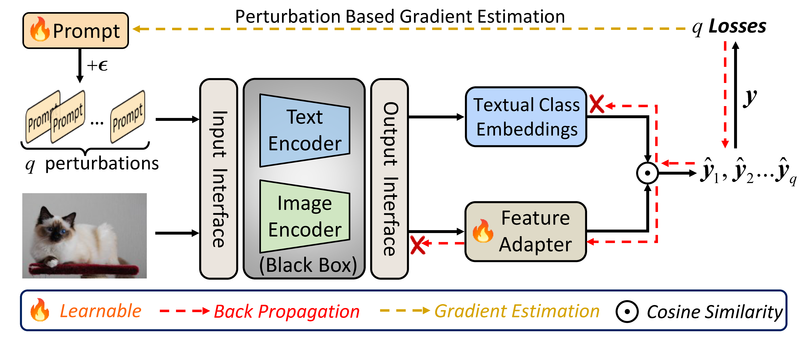

# CBBT
Official pytorch implementation of "Black-Box Tuning of Vision-Language Models with Effective Gradient Approximation" (EMNLP2023 Findings).

<p align="center">
 
<br>
<em>CBBT is a black-box tuning method for few-shot adaptation of vision-language models </em>
</p>


## Setup

### 1. Environment
Please follow the steps below to build your environment.

```bash
# Create a conda environment (Omit if you already have a suitable environment)
conda create -n dassl python=3.8
conda activate dassl
conda install pytorch==1.8.0 torchvision==0.9.0 torchaudio==0.8.0 cudatoolkit=11.1 -c pytorch -c conda-forge # torch (version >= 1.7.1)

# Clone this repo
git clone https://github.com/guozix/cbbt.git
cd cbbt

# install Dassl
cd Dassl.pytorch-master/
# Install dependencies
pip install -r requirements.txt
# Install this library (no need to re-build if the source code is modified)
python setup.py develop

cd ..
# Install CLIP dependencies
pip install -r requirements.txt

# Finished
```

### 2. Datasets

Follow [DATASETS.md](https://github.com/KaiyangZhou/CoOp/blob/main/DATASETS.md) to prepare the datasets.

Change the variable `DATA` in the training scripts `main.sh` to your dataset directory.

## Run

Train on the datasets:
``` bash
bash scripts/coop/main.sh eurosat rn50 end 1 16 False eurosat_rn50_1ctx 1 True True False 256 150 6000
bash scripts/coop/main.sh fgvc_aircraft rn50 end 1 16 False fgvc_rn50_1ctx_haug_fix 0 True True False 256 150 6000
bash scripts/coop/main.sh oxford_pets rn50 end 1 16 False oxford_pets_rn50_1ctx_haug_fix 1 True True False 256 150 6000
bash scripts/coop/main.sh oxford_flowers rn50 end 1 16 False oxford_flowers_rn50_1ctx_haug_fix 2 True True False 256 150 6000
...
```

## Citation

If you make use of our work, please cite our paper.
```bibtex
@inproceedings{
    guo2023blackbox,
    title={Black-Box Tuning of Vision-Language Models with Effective Gradient Approximation},
    author={Zixian Guo and Yuxiang Wei and Ming Liu and Zhilong Ji and Jinfeng Bai and Yiwen Guo and Wangmeng Zuo},
    booktitle={The 2023 Conference on Empirical Methods in Natural Language Processing},
    year={2023},
    url={https://openreview.net/forum?id=gybvlVXT6z}
}
```

## Acknowledgement

The code is based largely on the implementation of [CoOp](https://github.com/KaiyangZhou/CoOp) and [Dassl](https://github.com/KaiyangZhou/Dassl.pytorch). Thanks for their contributions!
